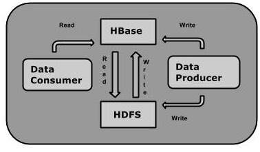
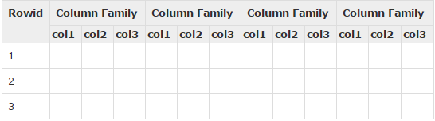
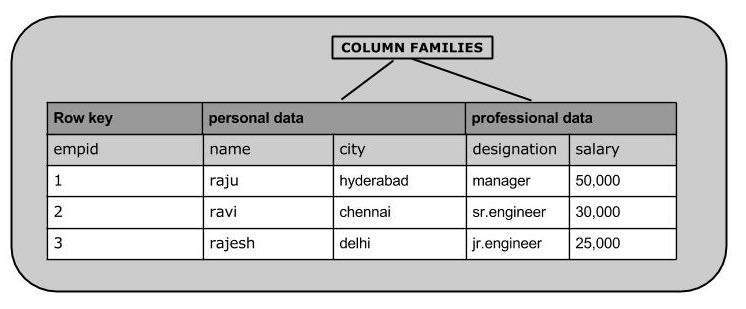
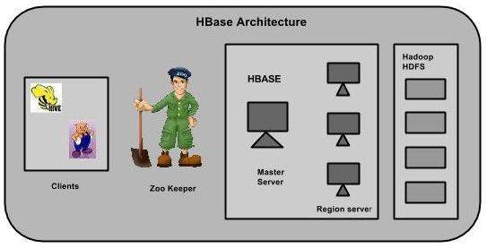
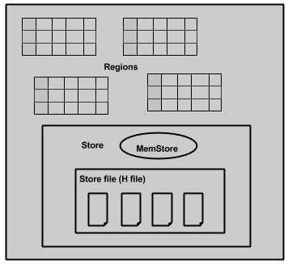

# Hadoop

Hadoop使用分布式文件系统来存储大数据，MapReduce来处理它。 Hadoop在存储和处理各种格式的巨大数据方面表现优异，如任意，半或甚至非结构化。Hadoop只能执行批处理，并且数据只能以顺序方式访问。这意味着，即使对于最简单的作业，也必须搜索整个数据集。

诸如HBase，Cassandra，couchDB，Dynamo和MongoDB等应用程序是存储大量数据并以随机方式访问数据的一些数据库。

# HBase

HBase是一个基于分布式列的数据库，建立在Hadoop文件系统之上。

HBase是一个数据模型，类似于Google的大表，旨在提供对大量结构化数据的快速随机访问。它利用Hadoop文件系统（HDFS）提供的容错功能。

它是Hadoop生态系统的一部分，提供对Hadoop文件系统中的数据的随机实时读/写访问。

可以直接或通过HBase将数据存储在HDFS中。数据消费者使用HBase随机读取/访问HDFS中的数据。 HBase位于Hadoop文件系统之上，提供读写访问。

HBase是一个面向列的数据库，其中的表按行排序。表模式仅定义列族，它们是键值对。表具有多个列族，每个列族可以具有任意数量的列。后续列值连续存储在磁盘上。表的每个单元格值都有一个时间戳。总之，在HBase中：
* Table is a collection of rows.
* Row is a collection of column families.
* Column family is a collection of columns.
* Column is a collection of key value pairs.

## Feature Of HBase 

* HBase is linearly scalable.
* It has automatic failure support.
* It provides consistent read and writes.
* It integrates with Hadoop, both as a source and a destination.
* It has easy java API for client.
* It provides data replication across clusters.

## Where to Use HBase 

* 对大数据进行随机，实时的读/写访问。
* 在商品硬件群集上托管非常大的表。
* 在Hadoop和HDFS之上工作。

# Architecture 

在HBase中，表分割成区域并由区域服务器提供服务。区域被列族垂直划分为“Stores”。Stores保存为HDFS中的文件。下面显示的是HBase的架构。

HBase有三个主要组件：客户端库，主服务器和区域服务器。可以根据需要添加或删除区域服务器。

## MasterServer 
* 将区域分配给区域服务器，并获得Apache ZooKeeper对此任务的帮助。
* 处理区域服务器上的区域的负载平衡。它卸载繁忙的服务器并将区域转移到占用较少的服务器。
* 通过协商负载平衡来维护集群的状态。
* 负责模式更改和其他元数据操作，如创建表和列族。

## Regions 

Regions are nothing but tables that are split up and spread across the region servers.

### Region server 
* 与客户端通信并处理与数据相关的操作。
* 处理对其下的所有区域的读取和写入请求。
* 按照区域大小阈值确定区域的大小。

Region server 包括 Regions 和 Stores：

The store contains memory store and HFiles. Memstore is just like a cache memory. Anything that is entered into the HBase is stored here initially. Later, the data is transferred and saved in Hfiles as blocks and the memstore is flushed.

## Zookeeper 

* Zookeeper is an open-source project that provides services like maintaining configuration information, naming, providing distributed synchronization, etc.
* Zookeeper has ephemeral nodes representing different region servers. Master servers use these nodes to discover available servers.
* In addition to availability, the nodes are also used to track server failures or network partitions.
* Clients communicate with region servers via zookeeper.
* In pseudo and standalone modes, HBase itself will take care of zookeeper.
