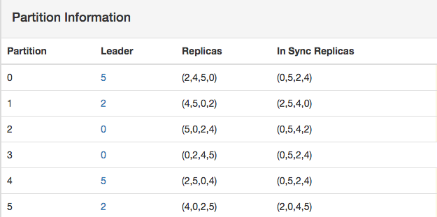
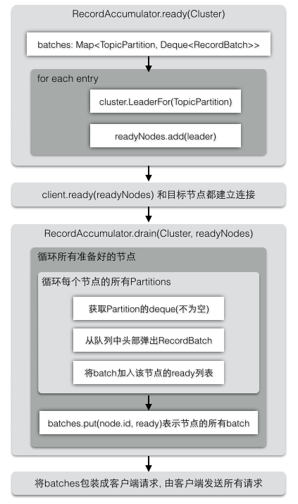
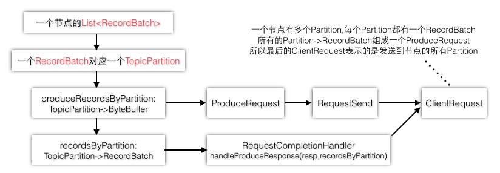
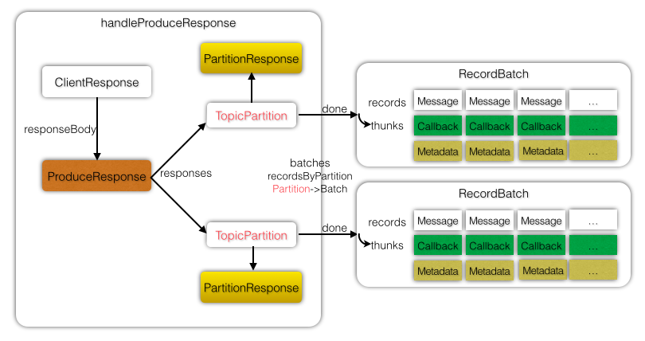
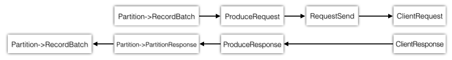
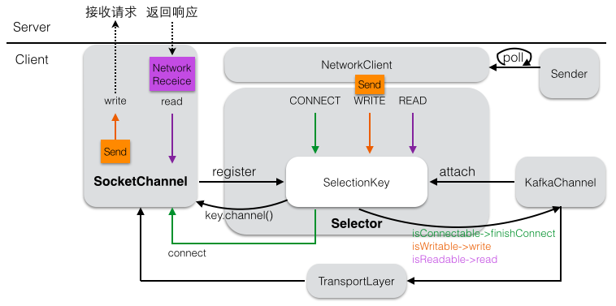
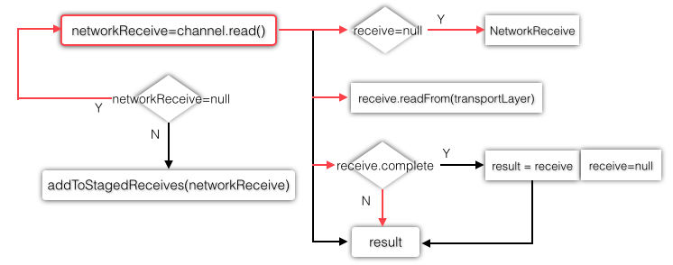
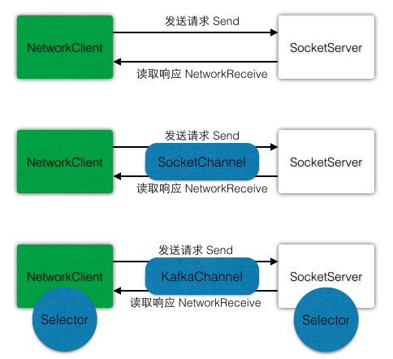
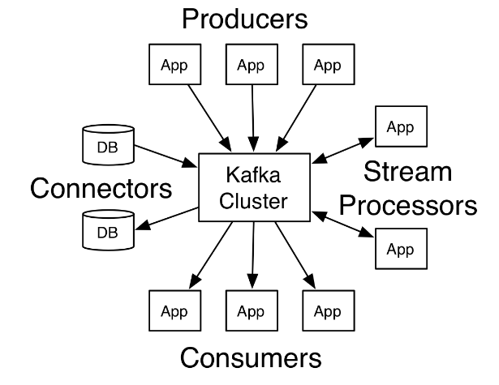

# Producer

生产者线程:异步发送消息,提供一个Callback;同步发送消息,则调用Future.get()会Block住直到结果返回.

```java
public class Producer extends Thread {
    private final KafkaProducer<Integer, String> producer;
    private final String topic;
    private final Boolean isAsync;

    public Producer(String topic, Boolean isAsync) {
        Properties props = new Properties();
        props.put("bootstrap.servers", "localhost:9092");
        props.put("client.id", "DemoProducer");
        props.put("key.serializer", "org.apache.kafka.common.serialization.IntegerSerializer");
        props.put("value.serializer", "org.apache.kafka.common.serialization.StringSerializer");
        producer = new KafkaProducer<Integer, String>(props);
        this.topic = topic;
        this.isAsync = isAsync;
    }

    public void run() {
        int messageNo = 1;
        while (true) {
            String messageStr = "Message_" + messageNo;
            if (isAsync) {  // Send asynchronously
                producer.send(new ProducerRecord<Integer, String>(topic, messageNo, messageStr), 
                    new Callback() {
                        public void onCompletion(RecordMetadata metadata, Exception e) {
                            System.out.println("The offset of the record we just sent is: " + metadata.offset());
                        }
                    }
                );
            } else {        // Send synchronously
                producer.send(new ProducerRecord<Integer, String>(topic, messageNo, messageStr)).get();
            }
            ++messageNo;
        }
    }
}
```

- KafkaProducer需要指定消息 Key,Value的类型. ProducerRecord还需要指定 topic.
- 根据配置文件创建KafkaProducer, 指定了Broker地址, Key,Value的序列化方式, 消息必须要指定topic
- 发送消息的返回结果RecordMetadata记录元数据包括了消息的 offset(在哪个partition的哪里 offset)


### blocking vs non-blocking

KafkaProducer.send方法返回的是一个 Future,那么它如何同时实现blocking方式和 non-blocking方式.

- blocking: 在调用send返回 Future时, 立即调用get, 因为Future.get在没有返回结果时会一直阻塞
- non-block: 提供一个callback,调用send后,可以继续发送消息而不用等待.当有结果返回时,callback会被自动通知执行


```java
public Future<RecordMetadata> send(ProducerRecord<K, V> record, Callback callback) {
        // first make sure the metadata for the topic is available
        long waitedOnMetadataMs = waitOnMetadata(record.topic(), this.maxBlockTimeMs);
        long remainingWaitMs = Math.max(0, this.maxBlockTimeMs - waitedOnMetadataMs);

        // 序列化key和 value
        byte[] serializedKey= keySerializer.serialize(record.topic(), record.key());
        byte[] serializedValue = valueSerializer.serialize(record.topic(), record.value());

        // 选择这条消息的Partition
        int partition = partition(record, serializedKey, serializedValue, metadata.fetch());
        TopicPartition tp = new TopicPartition(record.topic(), partition);
        RecordAccumulator.RecordAppendResult result = accumulator.append(tp, serializedKey, serializedValue, callback, remainingWaitMs);

        // 在每次追加一条消息到收集器之后,都要判断是否满了.如果满了,就执行一次Sender操作,通知Sender将这批数据发送到 Kafka
        if (result.batchIsFull || result.newBatchCreated) this.sender.wakeup();
        return result.future;
    }
```


在发送消息前,消息所属的topic必须已经建好,并且也指定这个topic的 partition数量(没有指定则默认是server.properties的 num.partitions).

```bash
bin/kafka-topics.sh --create --zookeeper localhost:2181 --replication-factor 3 --partitions 10 --topic test
```

### partition

一个Partition的主要组成部分是 topic名称,partition编号,所在的Leader,所有的副本,isr列表.表示这个Partition的分布情况.
public class PartitionInfo {
    private final String topic;
    private final int partition;
    private final Node leader;
    private final Node[] replicas;
    private final Node[] inSyncReplicas;
}
下图是kafka-manager中某个 topic 的PartitionInfo信息(副本数=4,Broker数量刚好也是4,导致每个Partition 都分布在所有Broker上).



在Cluster的构造函数中, 会根据所有节点和所有partitions构建集群状态信息.availablePartitions 只保存有Leader的 Partition.
> 正常来说每个Partition都是有 Leader Partition的. 如果Partition没有 Leader的话,说明这个Partition就是有问题的.

```java
    List<PartitionInfo> availablePartitions = new ArrayList<>();
    for (PartitionInfo part : partitionList) {
        if (part.leader() != null)
            availablePartitions.add(part);
    }
    this.availablePartitionsByTopic.put(topic, Collections.unmodifiableList(availablePartitions));
```

要选择消息所属的partition,首先需要知道 topic一共有多少个 partition(numPartitions),
所以metadata.fetch获得的 Cluster 信息中有topic->partitions的映射关系(partitionsByTopic).
消息有key的话,对key进行 hash,然后和partitions数量取模,类似于round-robin的方式来确定 key所在的 partition达到负载均衡.
如果消息没有key, 会根据递增的counter的值确定 partition, count不断递增,确保消息不会都发到同一个partition里.
> 问题: 写入消息时是写到Leader Partition的话,下面的代码如何体现Leader?
答案: 实际上为消息选择Partition,只是为了负载均衡, 跟Leader没有多大关系.
因为一个PartitionInfo一定能确定一个唯一的 Leader(一个Partition 只有一个Leader)
如果一个topic只有一个 Partition的话,在集群环境下就不能水平扩展:这个topic的消息只能写到一个节点.
而为一个topic设置多个 Partition,可以同时往多个节点的多个Partition写数据.
注意: 多个Partition都是同一个 topic的,每个Partition的逻辑意义都是相同的,只是物理位置不同而已.

```java
    public int partition(String topic, Object key, byte[] keyBytes, Object value, byte[] valueBytes, Cluster cluster) {
        // 这个topic所有的 partitions. 用来负载均衡, 即Leader Partition不要都分布在同一台机器上
        List<PartitionInfo> partitions = cluster.partitionsForTopic(topic);
        int numPartitions = partitions.size();
        if (keyBytes == null) {
            int nextValue = counter.getAndIncrement();
            // 这个topic可以使用的 partitions: availablePartitionsByTopic
            List<PartitionInfo> availablePartitions = cluster.availablePartitionsForTopic(topic);
            if (availablePartitions.size() > 0) {
                int part = DefaultPartitioner.toPositive(nextValue) % availablePartitions.size();
                return availablePartitions.get(part).partition();
            } else {
                // no partitions are available, give a non-available partition
                return DefaultPartitioner.toPositive(nextValue) % numPartitions;
            }
        } else {
            // hash the keyBytes to choose a partition
            return DefaultPartitioner.toPositive(Utils.murmur2(keyBytes)) % numPartitions;
        }
    }
```

下图是partition的分布算法.topic1有4个partition. 则总共有4个对应的PartitionInfo对象.
每个PartitionInfo(比如topic1-part1)都有唯一的Partition编号(1),replicas(1,2,3).
> 注意:replicas并不是一个 PartitionInfo对象,它们仅仅是某个Partition编号对应的 PartitionInfo的 replicas信息.
即partitionsForTopic和 availablePartitionsForTopic里面其实是没有 follower replics的.
因为如果Replicas都算作 PartitionInfo的话, 则Partition编号就不好表示了(4个Partition,每个Partition由3个副本).

> 实际上在选择Partition的时候,根本就先不要考虑replicas的存在. 就只有Partition编号.
每个Partition是分布在不同的节点上的(可以把这个Partition就认为是 Leader Partition).
然后在写消息的时候采用round-robin方式将消息平均负载到每一个 Partition上.
假设第一条消息写到了topic1-part1,则下一条消息就写到topic1-part2,以此类推.


### RecordAccumulator

由于生产者发送消息是异步地,所以可以将多条消息缓存起来,等到一定时机批量地写入到Kafka集群中,RecordAccumulator就扮演了缓冲者的角色.
生产者每生产一条消息,就向accumulator中追加一条消息,并且要返回本次追加是否导致batch满了,如果batch满了,则开始发送这一批数据.
最开始以为 Deque<RecordBatch> 就是一个消息队列,实际上一批消息会首先放在RecordBatch中,然后Batch又放在双端队列中.


```java
    public RecordAppendResult append(TopicPartition tp, byte[] key, byte[] value, Callback callback, long maxTimeToBlock) throws InterruptedException {
        Deque<RecordBatch> dq = dequeFor(tp);
        synchronized (dq) {
            RecordBatch last = dq.peekLast();
            if (last != null) {
                FutureRecordMetadata future = last.tryAppend(key, value, callback, time.milliseconds());
                // 有旧的batch, 并且能往这个batch继续追加消息
                if (future != null) return new RecordAppendResult(future, dq.size() > 1 || last.records.isFull(), false);
            }
        }
        // 队列为空(没有一个RecordBatch,last=null), 或者新的RecordBatch为空(旧的Batch没有空间了,future=null), 则新分配一个Batch
        int size = Math.max(this.batchSize, Records.LOG_OVERHEAD + Record.recordSize(key, value));
        ByteBuffer buffer = free.allocate(size, maxTimeToBlock);
        synchronized (dq) {
            // 内存的ByteBuffer, 追加新消息时,会最终写到这个ByteBuffer中
            MemoryRecords records = MemoryRecords.emptyRecords(buffer, compression, this.batchSize);
            RecordBatch batch = new RecordBatch(tp, records, time.milliseconds());
            FutureRecordMetadata future = Utils.notNull(batch.tryAppend(key, value, callback, time.milliseconds()));
            dq.addLast(batch);
            incomplete.add(batch);
            return new RecordAppendResult(future, dq.size() > 1 || batch.records.isFull(), true);
        }
    }
```

batches是一个并发安全的,但是每个TopicPartition里的 ArrayDeque并不是线程安全的,所以在修改Deque时都需要同步块操作.
队列中只要有一个以上的batch(dq.size),或者追加了这条消息后,当前Batch中的记录满了(batch.records),就可以发送消息了.


RecordBatch的tryAppend判断MemoryRecords是否能容纳下新的消息,如果可以就追加,如果没有空间返回null,让调用者自己新建一个Batch.
所以一个RecordBatch只对应了一个MemoryRecords. 而一个MemoryRecords可以存放至多maxRecordSize大小的消息.
> 注意: 客户端传递的Callback是在这里和消息一起被加入的. 但是因为生产者是批量地写数据,所以回调函数是在一批数据完成后才被调用

```java
    public FutureRecordMetadata tryAppend(byte[] key, byte[] value, Callback callback, long now) {
        boolean roomEnough = this.records.hasRoomFor(key, value)
        if(!roomEnough) return null;
        this.records.append(0L, key, value);
        this.maxRecordSize = Math.max(this.maxRecordSize, Record.recordSize(key, value));
        FutureRecordMetadata future = new FutureRecordMetadata(this.produceFuture, this.recordCount);
        if (callback != null) thunks.add(new Thunk(callback, future));
        this.recordCount++;
        return future;
    }
```

> 思考:为什么追加数据的offset固定是0? 实际上由于消息之间都是独立的,一条消息自己是无法确定自己的offset的. 那么offset是怎么管理的?

在Sender线程开始运行之前,首先要找到每个PartitionInfo的Leader节点,由RecordAccumulator统一收集已经准备好的节点.

```java
    public ReadyCheckResult ready(Cluster cluster, long nowMs) {
        Set<Node> readyNodes = new HashSet<Node>();
        // batches: 每个TopicPartition都对应了一个双端队列
        for (Map.Entry<TopicPartition, Deque<RecordBatch>> entry : this.batches.entrySet()) {
            TopicPartition part = entry.getKey();
            Deque<RecordBatch> deque = entry.getValue();
            // 找出这个TopicPartition的 Leader节点, 在正式开始发送消息时, 会先建立到这些节点的连接
            Node leader = cluster.leaderFor(part);
            if (leader == null) {
                unknownLeadersExist = true;
            } else if (!readyNodes.contains(leader)) {
                synchronized (deque) {
                    RecordBatch batch = deque.peekFirst();
                    if (batch != null) {
                        boolean sendable = full || expired || exhausted || closed || flushInProgress();
                        if (sendable && !backingOff) {
                            // 加入到等待连接的节点中.
                            readyNodes.add(leader);
                        } else {
                            nextReadyCheckDelayMs = Math.min(timeLeftMs, nextReadyCheckDelayMs);
                        }
                    }
                }
            }
        }
        return new ReadyCheckResult(readyNodes, nextReadyCheckDelayMs, unknownLeadersExist);
    }
```

数据有生产就会有被消费的地方,对应Deque队列的话,将RecordBatch加入,就有对应的pollFirst获取并删除第一个 batch.
由于在生产数据的时候,每个TopicPartition都有自己的队列,并且都统一被收集到了RecordAccumulator的 batches中.
在消费数据的时候,最好对batches中的每个 TopicPartition重新整理成以 Node节点为级别,对后面的发送流程是有很大帮助的.



```java
public Map<Integer, List<RecordBatch>> drain(Cluster cluster, Set<Node> nodes, int maxSize, long now) {
        Map<Integer, List<RecordBatch>> batches = new HashMap<Integer, List<RecordBatch>>();
        for (Node node : nodes) {
            int size = 0;
            List<PartitionInfo> parts = cluster.partitionsForNode(node.id());  // 节点上所有的Partition
            List<RecordBatch> ready = new ArrayList<RecordBatch>(); // 用来保存这个节点的Batch
            int start = drainIndex = drainIndex % parts.size();     // 为了不被饿死,start并不是从0开始. 初始时,start=drainIndex
            do {
                PartitionInfo part = parts.get(drainIndex);
                Deque<RecordBatch> deque = dequeFor(new TopicPartition(part.topic(), part.partition()));
                if (deque != null) {                                // 并不是所有的Partition都有队列的
                    synchronized (deque) {                          // 队列不是线程安全的,需要同步块
                        RecordBatch first = deque.peekFirst();      // Batch加入到队列的时候是加到尾部, 拉取Batch时则从头部, 所以叫做双端队列嘛
                        if (first != null) {
                            RecordBatch batch = deque.pollFirst();  // 上面并没有把Batch从队列中删除, 如果这个Batch真的可以被消费,才真正删除(在first后做了一些判断,这里省略了)
                            batch.records.close();                  // 释放内存
                            ready.add(batch);                       // 添加到待发送列表中
                        }
                    }
                }
                this.drainIndex = (this.drainIndex + 1) % parts.size();
            } while (start != drainIndex);                          // 直到遍历完这个节点所有的Partition,说明这个节点不会有其他的Partition了,可以放心地退出循环

            batches.put(node.id(), ready);                          // Batch是以 Node为级别的.表示这个 Node可以接受一批的 RecordBatch. 因为每个RecordBatch的 Partition都是无序的.
        }
        return batches;
    }
```

### Sender

RecordAccumulator.RecordAppendResult的 batch满了,唤醒Sender线程.Sender线程的启动在创建 KafkaProducer时.
Sender再唤醒 NetworkClient(不是线程,相当于通知客户端开始服务了),client也唤醒 Selector,最终唤醒NIO的 Selector.

> 为什么需要有wakeup动作:因为可能有线程在select等待事件被阻塞了(没有事件),通过wakeup唤醒那个线程开始工作(有事件进来了)

Sender不仅承载了 RecordAccumulator记录的收集器,也要通知客户端服务:把Accumulator收集的批记录通过客户端发送出去.
Sender作为一个线程,是在后台不断运行的,如果线程被停止,可能RecordAccumulator中还有数据没有发送出去,所以要优雅地停止.

```java
    public void run() {
        while (running) {
            run(time.milliseconds());
        }
        while (!forceClose && (this.accumulator.hasUnsent() || this.client.inFlightRequestCount() > 0)) {
            run(time.milliseconds());
        }
        this.client.close();
    }
```

发送消息的工作统一由Sender来控制.之前的wakeup只是一个通知,实际的工作还是由线程的run方法来控制的.
同样调用client.send也只是把请求先放到队列中, client.poll才是会将读写真正发送到 socket链路上.

```java
    public void run(long now) {
        Cluster cluster = metadata.fetch();
        // ① get the list of partitions with data ready to send
        RecordAccumulator.ReadyCheckResult result = this.accumulator.ready(cluster, now);
        // ② remove any nodes we aren't ready to send to  建立到Leader的 Socket连接
        Iterator<Node> iter = result.readyNodes.iterator();
        long notReadyTimeout = Long.MAX_VALUE;
        while (iter.hasNext()) {
            Node node = iter.next();
            if (!this.client.ready(node, now)) {
                iter.remove();
                notReadyTimeout = Math.min(notReadyTimeout, this.client.connectionDelay(node, now));
            }
        }

        // ③ create produce requests 之前加入到了accumulator收集器中, 现在从收集器获取出最开始放入的消息
        Map<Integer, List<RecordBatch>> batches = this.accumulator.drain(cluster, result.readyNodes, this.maxRequestSize, now);
        // ④ Transfer the record batches into a list of produce requests on a per-node basis 以节点为级别的生产请求列表. 即每个节点只有一个ClientRequest
        List<ClientRequest> requests = createProduceRequests(batches, now);

        long pollTimeout = Math.min(result.nextReadyCheckDelayMs, notReadyTimeout);
        // ⑤ Queue up the given request for sending. Requests can only be sent out to ready nodes. 从注释中可以看出这是一个入队列的操作
        for (ClientRequest request : requests) client.send(request, now);
        // ⑥ Do actual reads and writes to sockets. 这里才是真正的读写操作
        this.client.poll(pollTimeout, now);
    }
```

accumulator在之前一直 append数据,到真正要发送一批数据时,先①准备(ready)需要发送的partitions到哪些 Nodes上,②并建立到节点的连接
然后③构造每个Node需要的 RecordBatch列表(一个节点同时可以接受多批数据),④并转换为客户端的请求ClientRequest.


由于batches已经是按照节点划分好的了,所以创建的客户端请求也是按照节点划分好了.不过虽然produceRequest方法中的 batches
是某个节点所有的batches,但是客户端请求面向的还是Partition级别! 所以要对batches重新按照 Partition的粒度整理.
不过注意的是一个节点只有一个ClientRequest,它本身并不关心包含了多少个Partition,你只要需要发送的对象包装成RequestSend即可.



> 问题: batches中会不会有相同的Partition? 不会的! 如果那样的话,两个Map的key因为都是Partition,会导致value被覆盖.但是怎么保证?

```java
    private ClientRequest produceRequest(long now, int destination, short acks, int timeout, List<RecordBatch> batches) {
        Map<TopicPartition, ByteBuffer> produceRecordsByPartition = new HashMap<TopicPartition, ByteBuffer>(batches.size());
        final Map<TopicPartition, RecordBatch> recordsByPartition = new HashMap<TopicPartition, RecordBatch>(batches.size());
        for (RecordBatch batch : batches) {
            TopicPartition tp = batch.topicPartition;                   // 每个RecordBatch都有唯一的TopicPartition
            produceRecordsByPartition.put(tp, batch.records.buffer());  // RecordBatch的records是MemoryRecords,底层是ByteBuffer
            recordsByPartition.put(tp, batch);
        }
        // 构造生产者的请求(每个Partition都有生产记录), 并指定目标节点,请求头和请求内容, 转换为发送请求对象
        ProduceRequest request = new ProduceRequest(acks, timeout, produceRecordsByPartition);
        RequestSend send = new RequestSend(Integer.toString(destination), this.client.nextRequestHeader(ApiKeys.PRODUCE), request.toStruct());

        // 回调函数会作为客户端请求的一个成员变量, 当客户端请求完成后, 会触发回调函数的执行!
        RequestCompletionHandler callback = new RequestCompletionHandler() {
            public void onComplete(ClientResponse response) {
                handleProduceResponse(response, recordsByPartition, time.milliseconds());
            }
        };
        return new ClientRequest(now, acks != 0, send, callback);
    }
```

> ProduceRequest是 Producer的生产请求,需要 acks和 timeout这两个参数,在后面的DelayedOperation中会用到.

### ClientRequest & ClientResponse & Callback

ClientRequest是客户端的请求,这个请求会被发送(Send)到服务器上,所以它包装的是RequestSend.

ClientResponse是客户端的响应,也需要ClientRequest是因为请求有返回值时响应要和请求对的上.

由于Callback是附加在 Request里的,为了让Response能够触发 Callback回调,将Request设置到 Response.

```java
// A request being sent to the server. This holds both the network send as well as the client-level metadata.
public final class ClientRequest {
    private final long createdTimeMs;
    private final boolean expectResponse;
    private final RequestSend request;
    private final RequestCompletionHandler callback;
    private final boolean isInitiatedByNetworkClient;
    private long sendTimeMs;
}
// A response from the server. Contains both the body of the response as well as the correlated request that was originally sent.
public class ClientResponse {
    private final long receivedTimeMs;
    private final boolean disconnected;
    private final ClientRequest request;
    private final Struct responseBody;
}
```

回调函数传给了ClientRequest客户端请求,当客户端真正发生读写后(poll),会产生ClientResponse对象,触发回调函数的执行.
因为回调对象RequestCompletionHandler的回调方法 onComplete的参数是 ClientResponse.
NetworkClient.poll是真正发生读写的地方,所以它也会负责生成客户端的响应信息.


```java
    public List<ClientResponse> poll(long timeout, long now) {
        // .....真正的读写操作, 会生成responses

        // invoke callbacks
        for (ClientResponse response : responses) {
            if (response.request().hasCallback()) {
                response.request().callback().onComplete(response);
            }
        }
        return responses;
    }
```

到poll出来的 responses是一个列表(客户端请求也是一个列表).每个ClientRequest和 ClientResponse都是针对一个节点的.
再次强调下,发生在Client级别的动作都是针对每个节点而言,至于底层每个节点分成多个Partition则需要自己把内容封装进去.

```java
        for (ClientRequest request : requests) 
            client.send(request, now);
```

### handleProduceResponse

每个ClientResponse代表的是一个节点的响应,要从中解析出ProduceResponse中所有 Partition的 PartitionResponse.



```java
    private void handleProduceResponse(ClientResponse response, Map<TopicPartition, RecordBatch> batches, long now) {
        if (response.hasResponse()) {                       // if we have a response, parse it
            ProduceResponse produceResponse = new ProduceResponse(response.responseBody());
            for (Map.Entry<TopicPartition, ProduceResponse.PartitionResponse> entry : produceResponse.responses().entrySet()) {
                TopicPartition tp = entry.getKey();         // 每一个TopicPartition都对应一个PartitionResponse
                ProduceResponse.PartitionResponse partResp = entry.getValue();
                Errors error = Errors.forCode(partResp.errorCode);
                RecordBatch batch = batches.get(tp);        // 因为batches中对一个Partition只会有一个RecordBatch
                completeBatch(batch, error, partResp.baseOffset, correlationId, now);   // 完成这个RecordBatch, 调用RecordBatch.done    
            }
        } else {  // this is the acks = 0 case, just complete all requests
            for (RecordBatch batch : batches.values()) completeBatch(batch, Errors.NONE, -1L, correlationId, now);
        }
    }
    private void completeBatch(RecordBatch batch, Errors error, long baseOffset, long correlationId, long now) {
        batch.done(baseOffset, error.exception());  // tell the user the result of their request
        this.accumulator.deallocate(batch);         // release resource include remove from incomplete and deallocate batch's records memory
    }
```

这里的ClientRequest和 ClientResponse分别由 ProduceRequest和 ProduceResponse组成,两者有一定的共同点.



客户端组织生成的每一批Batch记录都属于一个 Partition,所以每个Batch都要 complete(调用RecordBatch.done).
每次Batch中,如果客户端不需要响应,则baseOffset=-1,否则从response中解析出 baseOffset用来表示消息的 offset.
由于RecordBatch记录的是每一条消息,每条消息都有Callback的话,一个Batch里就有和消息数量相等的 thunks(callback).

```java
    public void done(long baseOffset, RuntimeException exception) {
        // execute callbacks
        for (int i = 0; i < this.thunks.size(); i++) {
            Thunk thunk = this.thunks.get(i);
            if (exception == null) {
                RecordMetadata metadata = new RecordMetadata(this.topicPartition,  baseOffset, thunk.future.relativeOffset());
                thunk.callback.onCompletion(metadata, null);
            } else {
                thunk.callback.onCompletion(null, exception);
            }
        }
        this.produceFuture.done(topicPartition, baseOffset, exception);
    }
```

客户端追加消息时附属的Callback终于在这里出现了.我们看到了很熟悉的RecordMetadata对象作为onCompletion的回调参数

```java
    new Callback() {
        public void onCompletion(RecordMetadata metadata, Exception e) {
            System.out.println("The offset of the record we just sent is: " + metadata.offset());
        }
    }
```

### Selector

NetworkClient的请求一般都是交给 Selector去完成的. Selector使用 NIO异步非阻塞模式管理连接,读写请求.
Selector用一个单独的线程就可以管理多个网络连接的 channel,并能够知晓通道是否为读写事件做好准备.

### connect连接

客户端在和节点连接的时候,会创建和服务端的SocketChannel连接通道.Selector维护了每个目标节点对应的 KafkaChannel.


```java
    public void connect(String id, InetSocketAddress address, int sendBufferSize, int receiveBufferSize) {
        SocketChannel socketChannel = SocketChannel.open();
        socketChannel.configureBlocking(false);
        Socket socket = socketChannel.socket();     // 这是客户端,所以返回的是Socket
        socketChannel.connect(address);             // 连接服务端, 注意这里并没有开始真正连接, 或者说因为是非阻塞方式, 是发起一个连接
        SelectionKey key = socketChannel.register(nioSelector, SelectionKey.OP_CONNECT);    // 连接事件
        KafkaChannel channel = channelBuilder.buildChannel(id, key, maxReceiveSize);        // 会创建包括底层的transportLayer等.
        key.attach(channel);                        // 将KafkaChannel注册到SelectionKey
        this.channels.put(id, channel);             // Selector维护了每个nodeConnectionId以及KafkaChannel
    }
```

因为是非阻塞模式,此时调用connect()可能在连接建立之前就返回了.为了确定连接是否建立,需要再调用finishConnect()确认完全连接上了.

### KafkaChannel finishConnect

finishConnect会作为key.isConnectable的处理方法.在确认连接后可以取消Connect事件,并添加READ事件.
> 为什么在成功连接之后就注册了READ,首先只有成功连接,才可以进行读写操作.对于客户端的读一般都是读取响应结果.
而什么时候响应结果返回给客户端是不确定的,所以不能在发送请求的时候注册读,因为有些发送请求并不需要读取结果的.

```java
    public void finishConnect() throws IOException {
        socketChannel.finishConnect();
        key.interestOps(key.interestOps() & ~SelectionKey.OP_CONNECT | SelectionKey.OP_READ);
    }
```

### send发送

客户端发送的每个Send请求会被用到一个 KafkaChannel中.如果一个KafkaChannel上还有未发送成功的 Send请求.
则后面的请求不允许发送.也就是说客户端发送请求给服务端,在一个KafkaChannel中,一次只能发送一个Send请求.

```java
    public void send(Send send) {                   // NetworkClient的send方法发送的是ClientRequest的RequestSend
        KafkaChannel channel = channelOrFail(send.destination());
        channel.setSend(send);                      // 设置当前发送的Send请求是KafkaChannel要处理的请求
    }
    private KafkaChannel channelOrFail(String id) {
        return this.channels.get(id);
    }
```

### KafkaChannel.setSend

客户端的请求Send设置到 KafkaChannel中,KafkaChannel的 TransportLayer会为 SelectionKey注册 WRITE事件.
Channel的 SelectionKey有了 Connect和 Write事件,在Selector的轮询过程中当发现这些事件到来,就开始执行真正的操作.
> 虽然一个KafkaChannel一次只能处理一个 Send请求,每次Send时都要添加 WRITE事件,当Send发送成功后,
就要取消掉WRITE. 下一个Send请求事件进来时,继续添加WRITE,然后在请求发送成功后,又取消WRITE.
因为KafkaChannel是由请求事件驱动的.如果没有请求就不需要监听WRITE,KafkaChannel就不需要做写操作.
基本流程就是: 开始发送一个Send请求->注册OP_WRITE-> 发送请求... ->Send请求发送完成->取消OP_WRITE

```java
    public void setSend(Send send) {
        // 如果存在send请求,说明之前的Send请求还没有发送完毕,新的请求不能进来! 什么时候send=null: 请求发送完毕时
        if (this.send != null) throw new IllegalStateException("Attempt to begin a send operation with prior send operation still in progress.");
        this.send = send;
        this.transportLayer.addInterestOps(SelectionKey.OP_WRITE);
    }
    // 这是KafkaChannel的 transportLayer的方法, transportLayer的 key来自于 buildChannel的 SelectionKey
    public void addInterestOps(int ops) {
        key.interestOps(key.interestOps() | ops);
    }
```

现在对于客户端而言,连接,读,写事件都有了(CONNECT,READ,WRITE).在selector的轮询中可以操作读写事件.

![(./20160120174334217)]

### poll轮询

轮询的策略是如果有数据(timeout=0)直接调用nioSelector.selectNow,否则每隔一定时间触发一次select调用.
绑定到SelectionKey上的是 KafkaChannel,基于Kafka的传输层 TransportLayer包含了 IO层的 SocketChannel.



> poll轮询.一次轮询调用是不断地while循环. 当然它的条件是能够选择到感兴趣的SelectionKey集合.
在得到SelectionKey后,获取其中的KafkaChannel,因为Channel上有事件发生,然后选择对应的操作.

> 在一开始时,我们为SocketChannel注册了某类SelectionKey,并绑定KafkaChannel到key上.
当SocketChannel上有读写事件时,SelectionKey会被触发,就能取到绑定时的KafkaChannel.

```java
    public void poll(long timeout) throws IOException {
        clear();
        if (hasStagedReceives()) timeout = 0;
        int readyKeys = select(timeout);                //选择器,触发立即调用,或者定时调用
        if (readyKeys > 0) {
            Set<SelectionKey> keys = this.nioSelector.selectedKeys();
            Iterator<SelectionKey> iter = keys.iterator();
            while (iter.hasNext()) {
                SelectionKey key = iter.next();
                iter.remove();
                KafkaChannel channel = channel(key);    //获得绑定到SelectionKey的通道
                /* complete any connections that have finished their handshake */
                if (key.isConnectable()) channel.finishConnect();
                /* if channel is not ready finish prepare */
                if (channel.isConnected() && !channel.ready()) channel.prepare();

                /* if channel is ready read from any connections that have readable data */
                if (channel.ready() && key.isReadable() && !hasStagedReceive(channel)) {
                    NetworkReceive networkReceive;
                    while ((networkReceive = channel.read()) != null)
                        addToStagedReceives(channel, networkReceive);
                }
                /* if channel is ready write to any sockets that have space in their buffer and for which we have data */
                if (channel.ready() && key.isWritable()) {
                    Send send = channel.write();
                    if (send != null) this.completedSends.add(send);
                }
                /* cancel any defunct sockets */
                if (!key.isValid()) close(channel);
            }
        }
        addToCompletedReceives();  // 没有新的SelectionKey了! 说明要读取的已经都读取完了.  
        //不过Selector.poll<-NetworkClient.poll<-Sender.run是在这里循环的,每隔一段时间就会poll一次!
    }
```

### KafkaChannel write

写操作的事件没有使用while循环来控制,而是在完成发送时取消掉Write事件.如果Send在一次 write调用时没有写完,
SelectionKey的 OP_WRITE事件没有取消,下次isWritable事件会继续触发,直到整个Send请求发送完毕才取消.
所以发送一个完整的 Send请求是通过最外层的 while(iter.hasNext),即SelectionKey控制的.

```java
    public Send write() throws IOException {
        Send result = null;
        if (send != null && send(send)) {   //如果send方法返回值为false,表示send.completed=false,即这个请求还没有发送成功
            result = send;
            send = null;                    //发送完毕后,设置send=null,这样下一个请求判断到send=null,就可以将新的Send设置为KafkaChannel的当前send
        }
        return result;
    }
    private boolean send(Send send) throws IOException {
        send.writeTo(transportLayer);       //transportLayer有SocketChannel,所以是真正发生写的地方
        if (send.completed())               //只有Send请求全部写出去了,才对transportLayer取消WRITE事件
            transportLayer.removeInterestOps(SelectionKey.OP_WRITE);
        return send.completed();            //如果Send只发送了一点点,则SelectionKey还会监听到Writable事件的
    }
```

### KafkaChannel read

读取操作需要读取一个完整的NetworkReceive. 初始时receive=null,创建一个空的NetworkReceive.
receive(receive)方法从transportLayer中读取到 NetworkReceive对象中. 假设读了一次没有读完,
即receive.complete=false,read()返回的result=null,导致poll中的 while循环继续调用 read().



第二次读取时,receive!=null,继续从transportLayer读取到 receive对象中,这次成功地读完了,设置result
为读取成功的receive NetworkReceive,这个result不为空,while循环结束,调用addToStagedReceives.


```java
    public NetworkReceive read() throws IOException {
        NetworkReceive result = null;
        if (receive == null) receive = new NetworkReceive(maxReceiveSize, id);
        receive(receive);
        if (receive.complete()) {
            receive.payload().rewind();
            result = receive;
            receive = null;
        }
        return result;
    }
    private long receive(NetworkReceive receive) throws IOException {
        return receive.readFrom(transportLayer);
    }
```

> 比较读和写在poll中的处理方式.一旦有读操作,就要读取一个完整的NetworkReceive,如果是写,可以分多次写.
即读操作会在一次SelectionKey循环读取一个完整的接收动作,而写操作会在多次SelectionKey中完成一个完整的发送动作.
写完后(成功地发送了Send请求),会取消掉WRITE事件(本次写已完成). 而读完并没有取消掉READ事件(可能还要读新的数据).

### complte sends and receives

写操作会将当前发送成功的Send加入到completedSends. 因为每次写请求在每个通道中只会有一个.
读操作先加到stagedReceives,最后全部读取完之后才从stagedReceives复制到completedReceives.
completedSends和completedReceives分别表示在Selector端已经发送的和接收到的请求.
它们会在NetworkClient的poll调用之后被不同的handleCompleteXXX使用.

```java
    // 一次读操作就会有一个NetworkReceive生成,并加入到channel对应的队列中
    private void addToStagedReceives(KafkaChannel channel, NetworkReceive receive) {
        if (!stagedReceives.containsKey(channel))
            stagedReceives.put(channel, new ArrayDeque<NetworkReceive>());
        Deque<NetworkReceive> deque = stagedReceives.get(channel);
        deque.add(receive);
    }
    // 只有在本次轮询中没有读操作了(也没有写了), 在退出轮询时, 将上一步的所有NetworkReceive加到completedReceives
    private void addToCompletedReceives() {
        if (this.stagedReceives.size() > 0) {
            Iterator<Map.Entry<KafkaChannel, Deque<NetworkReceive>>> iter = this.stagedReceives.entrySet().iterator();
            while (iter.hasNext()) {
                Map.Entry<KafkaChannel, Deque<NetworkReceive>> entry = iter.next();
                KafkaChannel channel = entry.getKey();
                if (!channel.isMute()) {   // 当前通道上没有OP_READ事件时
                    Deque<NetworkReceive> deque = entry.getValue();
                    NetworkReceive networkReceive = deque.poll();
                    this.completedReceives.add(networkReceive);
                    if (deque.size() == 0) iter.remove();
                }
            }
        }
    }
```

> 问题1:最后加入到completedReceives的条件是 channel.isMute()=false,即通道上没有OP_READ事件时.但是什么时候会取消READ呢?

```java
    public boolean isMute() {
        return key.isValid() && (key.interestOps() & SelectionKey.OP_READ) == 0;
    }
```

> 问题2:deque.poll()是弹出一个元素,对于一个channel有多个元素,在while循环的是 channel级别,如何弹出某个channel的所有元素?

### NetworkClient

send动作将 ClientRequest添加到队列 inFlightRequests用来缓冲请求,
然后触发Selector->KafkaChannel->transportLayer添加 OP_WRITE写事件通知
poll动作也将实际处理交给 Selector,客户端服务于读和写,即发送和接收.
Selector在每次轮询调用之后,都会触发读写请求的完成handler,并添加到responses,用于回调函数的参数.
不管是Send发送请求还是 NetworkReceive接收请求,都可以被转换为ClientRequest表示客户端的请求.

```java
    public void send(ClientRequest request, long now) {
        String nodeId = request.request().destination();
        if (!canSendRequest(nodeId)) throw new IllegalStateException("Attempt to send a request to node " + nodeId + " which is not ready.");
        doSend(request, now);
    }
    private void doSend(ClientRequest request, long now) {
        this.inFlightRequests.add(request);             //还没开始真正发送,先加入到队列中
        selector.send(request.request());               //标记下收到的是Send请求.
    }

    public List<ClientResponse> poll(long timeout, long now) {
        // ① Selector轮询, 真正读写发生的地方. 如果客户端请求被完整地处理过了, 会加入到completeSends或complteReceives中
        this.selector.poll(Utils.min(timeout, metadataTimeout, requestTimeoutMs));
        // ② process completed actions 处理已经完成的动作,如果没有收到完整的请求,则不会被加入到completeXXX中
        List<ClientResponse> responses = new ArrayList<>();
        handleCompletedSends(responses, updatedNow);    //完成发送的handler
        handleCompletedReceives(responses, updatedNow); //完成接收的handler
        handleDisconnections(responses, updatedNow);    //断开连接的handler
        handleConnections();                            //处理连接的handler
        handleTimedOutRequests(responses, updatedNow);  //超时请求的handler
        // ③ invoke callbacks 将responses用于触发回调函数的调用
        return responses;
    }
```

### ready

Sender的 run中,在drain produce requests前会先判断 readyNodes是否已经准备好了,因为不会发送请求给没有准备好的节点.

```java
    Iterator<Node> iter = result.readyNodes.iterator();
    long notReadyTimeout = Long.MAX_VALUE;
    while (iter.hasNext()) {
        Node node = iter.next();
        if (!this.client.ready(node, now)) {
            iter.remove();
            notReadyTimeout = Math.min(notReadyTimeout, this.client.connectionDelay(node, now));
        }
    }
```

如果isReady返回 false,会先初始化连接initiateConnect,这里通过Selector向远程节点发起连接.
ready指的是已经建立连接,并且通道也准备好,也允许往inFlightRequests发送更多的请求.
如果是之前没有连接,现在刚刚发起连接请求,则不算准备好,因为连接动作肯定需要一定时间.

```java
    // Begin connecting to the given node, return true if we are already connected and ready to send to that node.
    public boolean ready(Node node, long now) {
        if (isReady(node, now)) return true;
        if (connectionStates.canConnect(node.idString(), now))
            initiateConnect(node, now);  // if we are interested in sending to a node and we don't have a connection to it, initiate one
        return false;
    }
    // Initiate a connection to the given node
    private void initiateConnect(Node node, long now) {
        String nodeConnectionId = node.idString();
        this.connectionStates.connecting(nodeConnectionId, now);
        selector.connect(nodeConnectionId, new InetSocketAddress(node.host(), node.port()), this.socketSendBuffer, this.socketReceiveBuffer);
    }

    // Check if the node with the given id is ready to send more requests.
    public boolean isReady(Node node, long now) {
        return !metadataUpdater.isUpdateDue(now) && canSendRequest(node.idString());
    }
    // Are we connected and ready and able to send more requests to the given connection?
    private boolean canSendRequest(String node) {
        return connectionStates.isConnected(node) && selector.isChannelReady(node) && inFlightRequests.canSendMore(node);
    }
```

注意可以往某个节点发送请求的最后一个条件: 队列为空,或者队列的第一个请求必须已经完成.
如果有客户端的上一次请求没有完成,说明这个节点有正在处理的请求,比较忙,则不允许发送给它.

```java
    public boolean canSendMore(String node) {
        Deque<ClientRequest> queue = requests.get(node);
        return queue == null || queue.isEmpty() ||
               (queue.peekFirst().request().completed() && queue.size() < this.maxInFlightRequestsPerConnection);
    }
```

我们还要继续看下什么条件才算是completed,对于ByteBufferSend是没有要发送的数据了,也没有正在写的数据.
所以这里的请求完成指的是上一个发送请求已经成功发送到服务端了,但并不需要等待那个请求收到响应结果.

```java
    public boolean completed() {
        return remaining <= 0 && !pending;
    }
```

### inFlightRequests.add

表示已经发送,或正在发送.并且还没有收到响应的(客户端)请求.请求首先加入到(目标节点对应的)队列中.


> 注意:上面ready的限制条件,则最开始的两个请求一定已经发送成功,否则请求3不会被添加到Deque中.
所以如果第一个请求发送到某个节点迟迟不能完成,有可能那个节点网络有问题,则后面的请求不会发送过来.
这就避免了因为网络阻塞,请求一直堆积在某个节点上.

使用队列虽然可以存储多个请求,但是新的请求能加进来的条件是上一个请求必须已经发送成功!

```java
    public void add(ClientRequest request) {
        Deque<ClientRequest> reqs = this.requests.get(request.request().destination());
        if (reqs == null) {
            reqs = new ArrayDeque<>();
            this.requests.put(request.request().destination(), reqs);
        }
        reqs.addFirst(request);     // 新的请求总是加到队列的头部.
    }
```

requests Map的 key是 request.request().destination(),表示这个请求要发送到哪个Broker节点上.
所以从这里也可以看出,现在的作用域都只是在客户端,因为只有客户端才有目标节点destination.
如果是Kafka作为服务端(目标节点),客户端连接服务端,就可以通过SocketChannel和服务端通信.

### client-server mode

> 注意doSend不只是用于 Producer发送,也可以用于Consumer消费.参数ClientRequest表示客户端的请求.
对于Kafka而言,P和C都是客户端.客户端发送请求给Kafka,从Kafka这方来说,都要Receive读取请求.
实际上KafkaProducer和 KafkaConsumer都有 NetworkClient,说明客户端是嵌入在P和C里面的.
Send请求的 destination, NetworkReceive的 source都表示远程的 Kafka节点.
因为在P和C的一亩三分地里, NetworkClient是它们和远程服务器交互的中间介质.
客户端和服务端只会有一个通道进行通信,所以客户端和服务端的交互只有两种形式:发送请求和读取响应.
Selector以及请求对象都只是 NetworkClient和 SocketServer之间互相通信上的一些介质.
只不过Selector提供了 NIO非阻塞 IO, 而请求对象(Send,NetworkReceive)是通信的数据.
不要认为NetworkClient和 Selector之间也有一层通道.通道只有跨机器(客户端和服务器)才会建立的连接.



还是以客户端发送请求为例,当NetworkClient把一个完整的请求发送到服务器,静静地等待服务端处理.
然后某个时刻服务端对这个请求的处理结果要发送给客户端, NetworkClient看到有响应消息过来了,不等静静了,
一点一点地接收响应,直到把响应结果完整地接收下来, 发送请求是Send,响应结果就是NetworkReceive.


不过有可能服务端发送完请求之后并不想知道这个请求的结果,那么它发送完就不管了. 和有响应结果的不同点是
ClientResponse的最后一个参数表示响应内容 body,在不期望得到响应时为null,有响应时为receive.payload.

> 比如CS模式中的 set和 get请求. set更改后并不需要知道响应,而get请求需要服务端返回一批数据给客户端.

> 注意:NetworkClient在发送完 set/get请求后,就会调用handleCompletedSends,表示请求已经发送到服务端了.
至于请求在服务端被处理,什么时候完成完全取决于服务端,当get请求收到响应时,才调用handleCompletedReceives.

### complete handler

客户端发送请求后,handleCompletedSends中对于有响应的请求,并不会将ClientRequest从 inFlightRequests中移除.
因为inFlightRequests表示的是还没有收到响应的客户端请求.而现在才发完请求,肯定还没收到响应,所以不会移除.
而如果是客户端请求不需要响应,则这时候是可以将ClientRequest从中删除,添加时放到头部,删除时也是从头部删除.
> 问:删除时也是从头部删除,如果第一个请求发送完毕,刚好来了第二个请求,这时候删除头部是删除哪个请求?
答1(×):前面一个请求发送完,如果它还没有完成,则第二个请求是不会进入到这个节点的队列中的.
只有前一个请求已经完成,下一个请求才可以进入到队列.确保下面的删除是删除已经完成的,而不是新进来刚开始的请求.

```java
    // Handle any completed request send. In particular if no response is expected, consider the request complete.
    private void handleCompletedSends(List<ClientResponse> responses, long now) {
        // if no response is expected then when the send is completed, return it
        for (Send send : this.selector.completedSends()) {
            // 这里获取目标节点的队列中第一个请求, 但并没有从队列中删除, 取出之后判断这个请求是否期望得到响应
            ClientRequest request = this.inFlightRequests.lastSent(send.destination());
            // 如果不需要响应,当Send请求完成时,就直接返回. 不过还是有ClientResponse对象的, 只不过最后一个参数为null,表示没有响应内容
            if (!request.expectResponse()) {
                this.inFlightRequests.completeLastSent(send.destination());
                responses.add(new ClientResponse(request, now, false, null));
            }
            // 如果客户端请求需要有响应, 那么它的响应是在下面的handleCompletedReceives中设置的.  
        }
    }
```

收到响应是在handleCompletedReceives,这时候才可以调用completeNext删除 source对应的 ClientRequest,
因为我们知道inFlightRequests存的是未收到请求的 ClientRequest,现在这个请求已经有响应了,就不需要再其中保存了.

> 问:inFlightRequests在这里的作用是什么? 首先每个节点都有一个正在进行中的请求队列,可以防止请求堆积(流控?).
当请求发送成功,还没有收到响应(对于需要响应的客户端请求而言)的这段时间里,ClientRequest是处于in-flight状态的.
同时每个节点的队列有个限制条件是:上一个请求没有发送完毕,下一个请求不能进来.或者队列中的未完成的请求数很多时都会限制.

> 不需要响应的流程:开始发送请求->添加到inFlightRequests-> 发送请求... ->请求发送成功->从inFlightRequests删除请求
需要响应的流程:开始发送请求->添加到inFlightRequests->发送请求...->请求发送成功->等待接收响应->接收到响应->删除请求

```java
    // Handle any completed receives and update the response list with the responses received.
    private void handleCompletedReceives(List<ClientResponse> responses, long now) {
        for (NetworkReceive receive : this.selector.completedReceives()) {
            String source = receive.source();
            // 接收到完整的响应了, 现在可以删除inFlightRequests中的 ClientRequest了.
            ClientRequest req = inFlightRequests.completeNext(source);

            ResponseHeader header = ResponseHeader.parse(receive.payload());
            // Always expect the response version id to be the same as the request version id
            short apiKey = req.request().header().apiKey();
            short apiVer = req.request().header().apiVersion();
            Struct body = ProtoUtils.responseSchema(apiKey, apiVer).read(receive.payload());
            correlate(req.request().header(), header);
            if (!metadataUpdater.maybeHandleCompletedReceive(req, now, body))
                responses.add(new ClientResponse(req, now, false, body));
        }
    }
```

### InFlightRequests complete

Deque是个双端队列,可以往头和尾方便地添加/删除/获取ClientRequest(前面Partition的 RecordBatch也用过 Deque).

```java
    //Get the oldest request (the one that that will be completed next) for the given node
    public ClientRequest completeNext(String node) {
        return requestQueue(node).pollLast();
    }
    // Get the last request we sent to the given node (but don't remove it from the queue)
    public ClientRequest lastSent(String node) {
        return requestQueue(node).peekFirst();
    }
    // Complete the last request that was sent to a particular node.
    public ClientRequest completeLastSent(String node) {
        return requestQueue(node).pollFirst();
    }
```

### Question

I'm reading new client design of version 0.9. and I has a question of inFlightRequests in and out.
Here is the basic flow :

When Sender send a ClientRequest to NetworkClient, it add to inFlightRequests indicator in-flight requests

```java
    private void doSend(ClientRequest request, long now) {
        this.inFlightRequests.add(request);
        selector.send(request.request());
    }
```

the inFlightRequests map node to deque. the new request add as first element of deque

```java
    public void add(ClientRequest request) {
        Deque<ClientRequest> reqs = this.requests.get(request.request().destination());
        if (reqs == null) {
            reqs = new ArrayDeque<>();
            this.requests.put(request.request().destination(), reqs);
        }
        reqs.addFirst(request);
    }
```

then poll happen on client and then selector, after success send this ClientRequest, the send will add to selector's completedSends

```java
    private void handleCompletedSends(List<ClientResponse> responses, long now) {
        // if no response is expected then when the send is completed, return it
        for (Send send : this.selector.completedSends()) {
            ClientRequest request = this.inFlightRequests.lastSent(send.destination());
            if (!request.expectResponse()) {
                this.inFlightRequests.completeLastSent(send.destination());
                responses.add(new ClientResponse(request, now, false, null));
            }
        }
    }
```

if this request doesn't need response, the ClientRequest will remove from inFlightRequest

```java
    public ClientRequest completeLastSent(String node) {
        return requestQueue(node).pollFirst();
    }
```

I'm curios why poll First? A scene like this: after the first ClientRequest sended out success,
and not yet execute to handleCompletedSends, another ClientRequest coming, and the new request addFirst to deque.
then pollFirst execute, as first element of deque now become to the new request, pollFirst will delete the new one, not old one.

```shell
CR1->inFlightRequests  |  CR1 send success  | CR2->inFlightRequests  | completeSends  |  pollFirst

first    last                                 first    last
-------------                                 -------------
CR1                                           CR2 CR1                      CR1           poll CR2, but CR2 is just come in!
-------------                                 -------------
```

I has also check NetworkClient.send->canSendRequest -> inFlightRequests.canSendMore(node) -> queue.peekFirst().request().completed()
only the first element of deque finish, then new request can send to the same node. but the condition of completed
by ByteBufferSend is remaining <= 0 && !pending. which means If Send sended success to server, it's completed!
Am I missing something(are there any other limitation)? Can some on point out. Tks.

## KafkaServer

上面的Producer和 Consumer都不是作为 Kafka的内置服务,而是一种客户端(所以它们都在clients包).
客户端可以独立于Kafka,和Kafka服务所在的节点互相隔离.Producer和 Consumer和 Kafka集群进行交互.
每个Kafka节点都有一些自己内置的服务进程,比如Broker,KafkaController,GroupCoordinator,ReplicaManager



接下来我们看下客户端的请求在服务端是怎么被处理的. 客户端有发送和接收请求, 服务端同样也有接收和发送的逻辑.
因为对于I/O来说是双向的:客户端发送请求,就意味着服务端要接收请求,同样服务端也会发送响应,客户端就要接收响应.

## Ref

- [apache kafka技术分享系列(目录索引)](http://blog.csdn.net/lizhitao/article/details/39499283)
- [Java NIO系列教程（八） SocketChannel](http://ifeve.com/socket-channel/)
