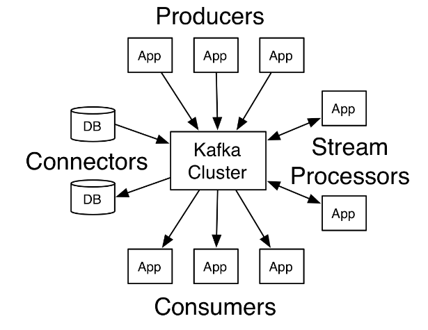

# Kafka



## Kafka use cases

* Log aggregation
* Stream processing
* Commit logs
* Click Stream tracking
* Messaging RedisUtil util = new RedisUtil("10.16.238.95:9000");

## Kafka Design

"linkedIn decided to build Kafka to address its need for monitoring activity stream data and operational metics as CPU, I/O usage, and request timings." 

* An API for producers and consumers to	support	custom implementation 
* Low overheads	for	network	and	storage	with message persistence on	disk 
* A	high throughput	supporting	millions of	messages for both publishing and subscribing—for example, real-time	log	aggregation	or data	feeds 
* Distributed and highly scalable architecture to handle low-latency delivery 
* Auto-balancing multiple consumers	in the case	of failure 
* Guaranteed fault-tolerance in	the	case of	server failures

## What is Kafka good for?

1. Building real-time streaming data pipelines that reliably get data between systems or applications
2. Building real-time streaming applications that transform or react to the streams of data

## Command

```create
bin/kafka-topics.sh --create --zookeeper localhost:2181 --replication-factor 1 --partitions 1 --topic test
```
