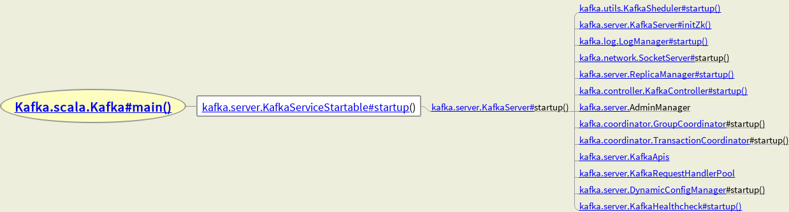

# Kafka Source Code Analysis

## Background

### MQ的通讯模式

Mode |	Feature
----- | --------
点对点通讯 |	点对点方式是最为传统和常见的通讯方式，它支持一对一、一对多、多对多、多对一等多种配置方式，支持树状、网状等多种拓扑结构。
多点广播 |	MQ 适用于不同类型的应用。其中重要的，也是正在发展中的是"多点广播"应用，即能够将消息发送到多个目标站点 (Destination List)。可以使用一条 MQ 指令将单一消息发送到多个目标站点，并确保为每一站点可靠地提供信息。MQ 不仅提供了多点广播的功能，而且还拥有智能消息分发功能，在将一条消息发送到同一系统上的多个用户时，MQ 将消息的一个复制版本和该系统上接收者的名单发送到目标 MQ 系统。目标 MQ 系统在本地复制这些消息，并将它们发送到名单上的队列，从而尽可能减少网络的传输量。
发布/订阅(Publish/Subscribe)模式 |	发布/订阅功能使消息的分发可以突破目的队列地理指向的限制，使消息按照特定的主题甚至内容进行分发，用户或应用程序可以根据主题或内容接收到所需要的消息。发布/订阅功能使得发送者和接收者之间的耦合关系变得更为松散，发送者不必关心接收者的目的地址，而接收者也不必关心消息的发送地址，而只是根据消息的主题进行消息的收发。
群集 (Cluster) |	为了简化点对点通讯模式中的系统配置，MQ 提供 Cluster(群集) 的解决方案。群集类似于一个域 (Domain)，群集内部的队列管理器之间通讯时，不需要两两之间建立消息通道，而是采用群集 (Cluster) 通道与其它成员通讯，从而大大简化了系统配置。此外，群集中的队列管理器之间能够自动进行负载均衡，当某一队列管理器出现故障时，其它队列管理器可以接管它的工作，从而大大提高系统的高可靠性。

关键概念

Concepts |	Function
-------- | ----------
Topic |	用于划分Message的逻辑概念，一个Topic可以分布在多个Broker上。
Partition |	是Kafka中横向扩展和一切并行化的基础，每个Topic都至少被切分为1个Partition。
Offset |	消息在Partition中的编号，编号顺序不跨Partition(在Partition内有序)。
Consumer |	用于从Broker中取出/消费Message。
Producer |	用于往Broker中发送/生产Message。
Replication |	Kafka支持以Partition为单位对Message进行冗余备份，每个Partition都可以配置至少1个Replication(当仅1个Replication时即仅该Partition本身)。
Leader |	每个Replication集合中的Partition都会选出一个唯一的Leader，所有的读写请求都由Leader处理。其他Replicas从Leader处把数据更新同步到本地。
Broker |	Kafka中使用Broker来接受Producer和Consumer的请求，并把Message持久化到本地磁盘。每个Cluster当中会选举出一个Broker来担任Controller，负责处理Partition的Leader选举，协调Partition迁移等工作。
ISR	| In-Sync Replica,是Replicas的一个子集，表示目前Alive且与Leader能够“Catch-up”的Replicas集合。由于读写都是首先落到Leader上，所以一般来说通过同步机制从Leader上拉取数据的Replica都会和Leader有一些延迟(包括了延迟时间和延迟条数两个维度)，任意一个超过阈值都会把该Replica踢出ISR。每个Leader Partition都有它自己独立的ISR。

### 设计思想

Concepts |	Function
-------- | ------------
Consumergroup |	各个consumer可以组成一个组，每个消息只能被组中的一个consumer消费，如果一个消息可以被多个consumer消费的话，那么这些consumer必须在不同的组。
消息状态 |	在Kafka中，消息的状态被保存在consumer中，broker不会关心哪个消息被消费了被谁消费了，只记录一个offset值（指向partition中下一个要被消费的消息位置），这就意味着如果consumer处理不好的话，broker上的一个消息可能会被消费多次。
消息持久化	| Kafka中会把消息持久化到本地文件系统中，并且保持极高的效率。
消息有效期	| Kafka会长久保留其中的消息，以便consumer可以多次消费，当然其中很多细节是可配置的。
批量发送 |	Kafka支持以消息集合为单位进行批量发送，以提高push效率。
push-and-pull |	Kafka中的Producer和consumer采用的是push-and-pull模式，即Producer只管向broker push消息，consumer只管从broker pull消息，两者对消息的生产和消费是异步的。
Broker之间的关系 |	不是主从关系，各个broker在集群中地位一样，我们可以随意的增加或删除任何一个broker节点。
负载均衡	| Kafka提供了一个 metadata API来管理broker之间的负载（对Kafka0.8.x而言，对于0.7.x主要靠zookeeper来实现负载均衡）。
同步异步	| Producer采用异步push方式，极大提高Kafka系统的吞吐率（可以通过参数控制是采用同步还是异步方式）。
分区机制partition |	Kafka的broker端支持消息分区，Producer可以决定把消息发到哪个分区，在一个分区中消息的顺序就是Producer发送消息的顺序，一个主题中可以有多个分区，具体分区的数量是可配置的。分区的意义很重大，后面的内容会逐渐体现。

### Kafka Replication

The leader maintains a set of in-sync replicas (ISR): the set of replicas that have fully caught up with the leader.
For each partition, we store in Zookeeper the current leader and the current ISR.
> Leader维护了ISR(能完全赶得上Leader的副本集).每个Partition当前的Leader和ISR信息会记录在ZooKeeper中.
问题:为什么是由Leader来维护ISR?
背景:Leader会跟踪与其保持同步的Replica列表，该列表称为ISR。如果一个Follower宕机，或者落后太多，Leader将把它从ISR中移除.
答案:只有Leader才能知道哪些Replica能够及时完全赶得上.所有Follower都会和Leader通信获取最新的消息.
但是Follower之间并不互相知道彼此的信息.所以由Leader来管理ISR最合适了.Leader还可以决定移除落后太多的Replicas.

Each replica stores messages in a local log and maintains a few important offset positions in the log.
The log end offset (LEO) represents the tail of the log.
The high watermark (HW) is the offset of the last committed message.
> 每个Replica都在自己的local log中存储消息,并在日志中维护了重要的offset位置信息.
LEO代表了日志的最新的偏移量,HW是最近提交消息的偏移量(HW也是每个Replica都有的吗?).

Each log is periodically synced to disks. Data before the flushed offset is guaranteed to be persisted on disks.
As we will see, the flush offset can be before or after HW.
> 每个日志都会定时地同步到磁盘.在flushed offset之前的数据一定能保存成功持久化到磁盘上.
flush offset可以在HW之前或者之后(因为follower只是先写到内存中然后返回ack给leader,hw增加时,
follower在内存中的消息不一定什么时候写到磁盘上,即可能在hw增加前就写到磁盘,或者等hw增加后才写到磁盘).

#### Writes
To publish a message to a partition, the client first finds the leader of the partition from
Zookeeper and sends the message to the leader.The leader writes the message to its local log.
Each follower constantly pulls new messages from the leader using a single socket channel.
That way, the follower receives all messages in the same order as written in the leader.
> 为了将消息发布给一个Partition,客户端会从ZK中先找到这个Partition的Leader,然后把消息发送给Leader.
Leader会将消息写到自己的本地日志文件中,(Partition的)每个follower会从Leader一直拉取数据.
通过这种方式,follower接收的所有消息的顺序一定和写到leader的消息是同样的顺序.

The follower writes each received message to its own log and sends an acknowledgment back to the leader.
Once the leader receives the acknowledgment from all replicas in ISR, the message is committed.
The leader advances the HW and sends an acknowledgment to the client.
> follower收到的每条消息都会写到自己的日志中,并且发送ack给leader.
一旦leader接收到在ISR中所有副本的ack,这条消息就会被提交.然后Leader会增加HW,并发送ack给客户端.

For better performance, each follower sends an acknowledgment after the message is written to memory.
So, for each committed message, we guarantee that the message is stored in multiple replicas in memory.
However, there is no guarantee that any replica has persisted the commit message to disks though.
Given that correlated failures are relatively rare, this approach gives us a good balance between response time and durability.
In the future, we may consider adding options that provide even stronger guarantees.
> 为了性能考虑,每个follower当消息被写到内存时就发送ack(而不是要完全地刷写到磁盘上才ack).
所以对于每条提交的消息,我们能够保证的是这条消息一定是存储在多个副本(所有ISR)的内存中.
但是并不保证任何副本已经把这条提交的消息持久化到磁盘中.这是基于响应时间和持久性两者平衡的.

The leader also periodically broadcasts the HW to all followers.
The broadcasting can be piggybacked(背负) on the return value of the fetch requests from the followers.
From time to time, each replica checkpoints its HW to its disk.
> Leader 也会定时地将HW广播给所有的 followers. 广播消息可以附加在从 follower过来的 fetch请求的结果中.
同时,每个副本(不管是 leader还是 follower)也会定时地将HW持久化到自己的磁盘上.
当follower向 leader 提交fetch请求时,leader 也会告诉所有的follower说,我现在的hw是多少了.这是一种保护机制.
假设只有leader 一个人保护了hw这个重要的信息,一旦leader不幸挂掉了,就没有人知道hw现在到底是多少了.
所以只要一有follower过来获取消息时,leader 就不厌其烦地像个老太婆不断地唠叨说我这一次的hw更新到了哪里.
每个follower也就都会知道 leader 的最新hw.这样即使leader挂掉了,hw仍然在其他 follower上都备份有这个重要信息.
几个follower在一阵商量后,选举出了新的leader,这些人都知道上一个 leader 最新的hw,因此hw这个香火会继续传承下去.

#### Reads

For simplicity, reads are always served from the leader. Only messages up to the HW are exposed to the reader.
> 为了简单起见,只有leader可以提供读消息的服务.并且最多只到hw位置的消息才会暴露给客户端.

-----------------------------------------------------------------------

Producer在发布消息到某个 Partition时，先通过Zookeeper找到该 Partition 的Leader，
然后无论该 Topic的 Replication Factor为多少（也即该 Partition有多少个 Replica），
Producer 只将该消息发送到该 Partition的 Leader。Leader 会将该消息写入其本地Log。每个 Follower都从 Leader pull数据。
这种方式上，Follower存储的数据顺序与 Leader保持一致。Follower在收到该消息并写入其 Log后，向 Leader 发送ACK。
一旦Leader 收到了ISR中的所有 Replica 的ACK，该消息就被认为已经commit了，Leader 将增加HW并且向 Producer 发送ACK。
为了提高性能，每个Follower 在接收到数据后就立马向 Leader 发送ACK，而非等到数据写入Log中。
因此，对于已经commit的消息，Kafka 只能保证它被存于多个Replica的内存中，而不能保证它们被持久化到磁盘中，
也就不能完全保证异常发生后该条消息一定能被Consumer消费。但考虑到这种场景非常少见，
可以认为这种方式在性能和数据持久化上做了一个比较好的平衡。在将来的版本中，Kafka会考虑提供更高的持久性。
Consumer读消息也是从 Leader读取，只有被commit过的消息（offset 低于HW的消息）才会暴露给Consumer。

Kafka的复制机制既不是完全的同步复制，也不是单纯的异步复制。事实上，
同步复制要求所有能工作的Follower都复制完，这条消息才会被认为commit，这种复制方式极大的影响了吞吐率。
而异步复制方式下，Follower异步的从 Leader 复制数据，数据只要被 Leader 写入log就被认为已经 commit，
这种情况下如果Follower 都复制完都落后于Leader，而如果Leader突然宕机，则会丢失数据。
而Kafka 的这种使用ISR的方式则很好的均衡了确保数据不丢失以及吞吐率。
Follower 可以批量的从Leader 复制数据，这样极大的提高复制性能（批量写磁盘），极大减少了 Follower 与Leader 的差距

-------------------------------------------------------------------------------------------------]

Checkpoint用在 Follower failure 是怎么解决HW的同步问题:
After a configured timeout period, the leader will drop the failed follower from its ISR
and writes will continue on the remaining replicas in ISR.
> 如果Follower失败了,在超过一定时间后,Leader 会将这个失败的 follower 从ISR中移除(follower 没有发送fetch请求)
由于ISR保存的是所有全部赶得上 Leader 的follower replicas,失败的follower肯定是赶不上了.
虽然ISR现在少了一个,但是并不会引起的数据的丢失,ISR中剩余的 replicas会继续同步数据(只要ISR中有一个 follower,就不会丢失数据)
(注意:这里讨论的是一个 Partition的 follower副本,而不是节点,如果是一个节点,它不止存储一个Partition,而且不都是follower)

If the failed follower comes back, it first truncates its log to the last checkpointed HW.
It then starts to catch up all messages after its HW from the leader.
When the follower fully catches up, the leader will add it back to the current ISR.
> 如果失败的follower恢复过来, 它首先将自己的日志截断到上次 checkpointed 时刻的HW(High Watermark).
因为checkpoint记录的是所有 Partition 的hw offset. 当follower失败时, checkpoint中关于这个 Partition 的HW就不会再更新了.
而这个时候存储的HW信息和 follower partition replica 的offset并不一定是一致的. 比如这个follower获取消息比较快,
但是ISR中有其他 follower复制消息比较慢,这样 Leader 并不会很快地更新HW,这个快的 follower 的hw也不会更新(leader 广播hw给 follower)
这种情况下,这个 follower日志的 offset 是比hw要大的.所以在它恢复之后,要将比hw多的部分截掉,然后继续从leader拉取消息(跟平时一样).
实际上,ISR中的每个 follower日志的 offset 一定是比hw大的.因为只有ISR中所有 follower都复制完消息,leader 才会增加hw.
也就是说有可能有些follower复制完了,而有些follower还没有复制完,那么hw是不会增加的,复制完的 follower的 offset 就比hw要大.

--------------------------------------------------------------------------------------------]

### 对于多个partition 和多个consumer有以下这样的限制条件：

- 如果consumer比 partition多，是浪费，因为kafka的设计是在一个 partition上是不允许并发的，所以consumer数不要大于 partition数
- 如果consumer比 partition少，一个consumer会对应于多个 partitions，这里主要合理分配consumer数和 partition数，否则会导致partition里面的数据被取的不均匀. 最好partiton数目是consumer数目的整数倍，所以partition数目很重要，比如取24，就很容易设定consumer数目
- 如果consumer从多个 partition读到数据，不保证数据间的顺序性，kafka只保证在一个 partition上数据是有序的，但多个partition，根据你读的顺序会有不同
- 增减consumer，broker，partition会导致 rebalance，所以rebalance后 consumer对应的 partition会发生变化

High-level接口中获取不到数据的时候是会 block住消费者线程的

```java
    String topic = "page_visits";
    String group = "pv";

    Properties props = new Properties();
    props.put("group.id", group);
    props.put("auto.offset.reset", "smallest"); // 必须要加，如果要读旧数据
    props.put("zookeeper.connect", "localhost:2181");
    props.put("zookeeper.session.timeout.ms", "400");
    props.put("zookeeper.sync.time.ms", "200");
    props.put("auto.commit.interval.ms", "1000");

    // 创建消费者到Kafka集群的连接(主要是通过ZooKeeper, 因为ZK中不仅记录了 Kafka集群的地址,也保管了每个 Partition 的最近 offset)
    ConsumerConfig conf = new ConsumerConfig(props);
    ConsumerConnector consumer = kafka.consumer.Consumer.createJavaConsumerConnector(conf);

    // topic和线程的对应关系, 这里放了一个topic, 并且用一个线程来消费
    Map<String, Integer> topicCountMap = new HashMap<String, Integer>();
    topicCountMap.put(topic, new Integer(1));

    // 消费者指定了要消费的topics, 返回所有topics的消息流. 返回的key是 topic名词, value是这个 topic的 KafkaStream消息流列表
    Map<String, List<KafkaStream<byte[], byte[]>>> consumerMap = consumer.createMessageStreams(topicCountMap);

    // 获取这个topic 的Kafka消息流, 一个topic是有多个消息流的, 因为会从多个Partition上读取消息
    List<KafkaStream<byte[], byte[]>> streams = consumerMap.get(topic);
    KafkaStream<byte[], byte[]> stream = streams.get(0); 

    // 读取消息, 使用KafkaStream, 获得流的迭代器, 包含了消息的key和 message
    ConsumerIterator<byte[], byte[]> it = stream.iterator();
    while (it.hasNext()){
        System.out.println("message: " + new String(it.next().message()));
    }
    // 其实执行不到，因为对于high level,没有数据的 话, 上面的hasNext 会block
    if (consumer != null) consumer.shutdown();
```

## Mind Map



## `kafka.scala.Kafka#main()`

``` scala
def main(args: Array[String]): Unit = {
    try {
      // 读取配置文件内容到Properties对象
      val serverProps = getPropsFromArgs(args)
      // 创建KafkaServerStartable对象
      val kafkaServerStartable = KafkaServerStartable.fromProps(serverProps)

      // attach shutdown handler to catch control-c
      Runtime.getRuntime().addShutdownHook(new Thread("kafka-shutdown-hook") {
        override def run(): Unit = kafkaServerStartable.shutdown()
      })

      kafkaServerStartable.startup()
      kafkaServerStartable.awaitShutdown()
    }
    catch {
      case e: Throwable =>
        fatal(e)
        Exit.exit(1)
    }
    Exit.exit(0)
  }
```
