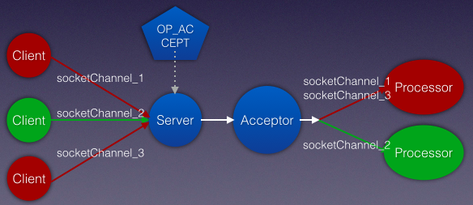
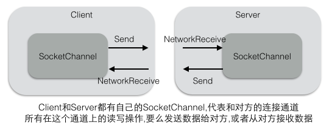
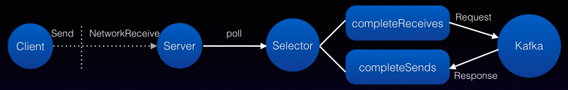
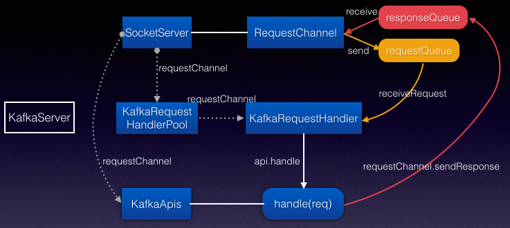

# Socketserver

> Kafka的 Broker内部分成:网络层,API层,日志存储层,副本复制. 这里先介绍网络层的SocketServer


SocketServer是一个 NIO的服务器,它的线程模型:

* 一个Acceptor线程接受/处理所有的新连接
* N个 Processor线程,每个Processor都有自己的 selector,从每个连接中读取请求
* M个 Handler线程处理请求,并将产生的请求返回给Processor线程用于写回客户端


SocketServer在启动时(Kafka->KafkaServer),会启动一个 Acceptor 和N个 Processor.

```scala
  def startup() {
      val brokerId = config.brokerId
      var processorBeginIndex = 0
      endpoints.values.foreach { endpoint =>
        val protocol = endpoint.protocolType
        val processorEndIndex = processorBeginIndex + numProcessorThreads
        for (i <- processorBeginIndex until processorEndIndex) {
          processors(i) = new Processor(i,time,maxRequestSize,requestChannel,connectionQuotas,connectionsMaxIdleMs,protocol,config.values,metrics)
        }
        //Processor线程是附属在 Acceptor线程中,随着Acceptor的创建而启动线程
        val acceptor = new Acceptor(endpoint, sendBufferSize, recvBufferSize, brokerId, processors.slice(processorBeginIndex, processorEndIndex), connectionQuotas)
        acceptors.put(endpoint, acceptor)
        //启动Acceptor线程
        Utils.newThread("kafka-socket-acceptor-%s-%d".format(protocol.toString, endpoint.port), acceptor, false).start()
        acceptor.awaitStartup()     //等待启动完成,通过CountDownLatch控制,在注册OP_ACCEPT后即可继续
        processorBeginIndex = processorEndIndex
      }
    }
```


## Acceptor

SelectionKey是表示一个 Channel和 Selector的注册关系。在Acceptor中的 selector，
只有监听客户端连接请求的ServerSocketChannel的 OP_ACCEPT事件注册在上面。
当selector的 select方法返回时，则表示注册在它上面的Channel发生了对应的事件。
在Acceptor中，这个事件就是OP_ACCEPT，表示这个ServerSocketChannel的 OP_ACCEPT事件发生了。
因此，Acceptor的 accept方法的处理逻辑为：首先通过SelectionKey来拿到对应的 ServerSocketChannel，
并调用其accept方法来建立和客户端的连接，然后拿到对应的SocketChannel并交给了 processor。
然后Acceptor的任务就完成了，开始去处理下一个客户端的连接请求。
Acceptor只负责接受新的客户端的连接,并将请求转发给Processor处理,采用Round-robin的方式分给不同的 Processor

```scala
  def run() {
      serverChannel.register(nioSelector, SelectionKey.OP_ACCEPT)
      startupComplete()
      var currentProcessor = 0
      while (isRunning) {
          val ready = nioSelector.select(500)
          if (ready > 0) {
            val keys = nioSelector.selectedKeys()
            val iter = keys.iterator()
            while (iter.hasNext && isRunning) {
                val key = iter.next
                iter.remove()
                if (key.isAcceptable) accept(key, processors(currentProcessor))
                // round robin to the next processor thread
                currentProcessor = (currentProcessor + 1) % processors.length
            }
          }
      }
  }
```

注册OP_ACCEPT时,注册到Selector上的 serverChannel是一个 ServerSocketChannel.
所以每个Processor都能获得 Acceptor成功的连接上的 SocketChannel.

```scala
  def accept(key: SelectionKey, processor: Processor) {
      val serverSocketChannel = key.channel().asInstanceOf[ServerSocketChannel]
      val socketChannel = serverSocketChannel.accept()
      processor.accept(socketChannel)
  }
```

客户端发起连接SocketChannel.connect,服务端接受这个连接ServerSocketChannel.accept,于是双方可以互相通信了.



## Processor

> Processor的主要职责是负责从客户端读取数据和将响应返回给客户端，
它本身不处理具体的业务逻辑，也就是说它并不认识它从客户端读取回来的数据。
每个Processor都有一个 Selector，用来监听多个客户端，因此可以非阻塞地处理多个客户端的读写请求。

由于采用Round-Robin的方式分配连接给 Processor,所以一个Processor会有多个 SocketChannel,对应多个客户端连接.
每个SocketChannel都代表服务端和客户端建立的连接,Processor通过一个 Selector不断轮询(并不需要每个连接对应一个Selector).



Processor接受一个新的 SocketChannel通道连接时,先放入LinkedQueue队列中,然后唤醒Selector线程开始工作
Processor在运行时会首先从通道队列中去取 SocketChannel,将客户端连接ID注册到 Selector中,
便于后面Selector能够根据 ConnectionID获取注册的不同的 SocketChannel(比如selector.completedReceives).

```scala
  //Acceptor会把多个客户端的数据连接 SocketChannel分配一个 Processor，因此每个Processor内部都有一个队列来保存这些新来的数据连接
  //把一个SocketChannel放到队列中，然后唤醒Processor的 selector
  def accept(socketChannel: SocketChannel) {
    newConnections.add(socketChannel)
    wakeup()
  }

  //如果有队列中有新的SocketChannel，则它首先将其OP_READ事件注册到该 Processor的 selector上面
  private def configureNewConnections() {
    while(!newConnections.isEmpty) {
        val channel = newConnections.poll()
        val localHost = channel.socket().getLocalAddress.getHostAddress
        val localPort = channel.socket().getLocalPort
        val remoteHost = channel.socket().getInetAddress.getHostAddress
        val remotePort = channel.socket().getPort
        val connectionId = ConnectionId(localHost, localPort, remoteHost, remotePort).toString
        selector.register(connectionId, channel)
    }
  }
```

回顾下客户端NetworkClient也是在 finishConnect的时候注册了 OP_READ事件,用于读取服务端的响应.
而对于服务端而言,在和客户端建立连接的时候,注册OP_READ事件, 是为了读取客户端发送的请求.


下面的Selector也是前面分析 KafkaProducer的 Selector.每次轮询一次调用都需要处理返回的completedReceives,completedSends等
所以KafkaProducer/KafkaConsumer和 SocketServer都采用 NIO Selector方式.当然客户端也可以是阻塞模式(比如OldProducer)
Selector模型是一种多路复用的通信模式,并不一定只在服务端才可以使用的.所以看到SocketServer使用了公用的 Selector.

```scala
  override def run() {
    startupComplete()
    while(isRunning) {
        configureNewConnections()   // setup any new connections that have been queued up
        processNewResponses()       // register any new responses for writing
        selector.poll(300)          // poll轮询逻辑已经在 KafkaProducer中分析过了

        // NetworkClient.poll之后对已经完成发送和已经完成接收的都进行了 handler处理. 这里也一样
        selector.completedReceives.asScala.foreach { receive =>
            //receive是 NetworkReceive, 其中包含了源节点地址, 对应configureNewConnections注册的第一个参数 connectionId
            val channel = selector.channel(receive.source)
            val session = RequestChannel.Session(new KafkaPrincipal(KafkaPrincipal.USER_TYPE, channel.principal.getName), channel.socketAddress)
            val req = RequestChannel.Request(processor = id, connectionId = receive.source, session = session, buffer = receive.payload, startTimeMs = time.milliseconds, securityProtocol = protocol)
            requestChannel.sendRequest(req)     //Request请求,发送给RequestChannel处理
            selector.mute(receive.source)       //移除OP_READ事件. 接收本身就是Read,接收到响应后,就不需要再读了
        }
        // 上面的completedReceives是服务端接收到客户端的请求,下面的completedSends是服务端要将响应返回给客户端
        selector.completedSends.asScala.foreach { send =>
            val resp = inflightResponses.remove(send.destination).getOrElse throw new IllegalStateException()  //[B]
            selector.unmute(send.destination)   //添加OP_READ事件. 这样才可以继续读取客户端的请求
        }
    }
    shutdownComplete()
  }
```

再和客户端的代码进行比较, 其实两者是有很多共同点的.

* 因为对于客户端和服务端而言,都有读写操作,所以也就都有Selector轮询产生的 completedSends,completedSends.
* 客户端的发送请求(Send)对于服务端而言是读取请求(NetworkReceive),反过来服务端的Send对应客户端的 NetworkReceive.
* 客户端Send的 destination对应服务端 NetworkReceive的 source. 反过来服务端Send的 dest对应客户端 NetworkReceice的 source.
* 客户端请求ClientRequest在还没有收到响应时会将请求放到 inFlightRequests中,对应服务端的requestChannel.
* inFlightRequests表示正在进行中的客户端请求,在客户端开始发送请求时就加入到缓冲队列中,只有收到请求对应的响应结果,才从队列中删除.
* inflightResponses表示正在进行中的服务端响应,也是在服务端开始发送响应请求时加入到队列中,只有响应发送成功,才从队列中删除.
* 完整的客户端到服务端的流程:加到inFlightRequests,服务端处理请求,加到inflightResponses,删除inflightResponses,删除inFlightRequests
* 客户端的send表示要发送一个 Send请求,但还没开始,服务端的processNewResponses也表示要发送一个 Response,但也没开始,所以都需要缓冲队列.
* 客户端从Sender-NetworkClient-Selector. 服务端从Acceptor-Processor-Selector. Selector是真正干活的(在底层的通道上读写数据).
* 而NetworkClient和 Processor会对读写请求的结果 completeXXX做进一步处理(可以和客户端的handleCompletedXXX做比较).
* 客户端建立连接时注册READ:它不知道什么时候服务端会返回消息,服务端配置新连接时也注册READ:它也不知道客户端什么时候发送请求过来
* 客户端在刚开始要发送Send请求时,会注册OP_WRITE,当发送完一个完整的Send请求后,会取消OP_WRITE
* 而服务端在连接时注册了READ,接收到一个完整的NetworkReceive请求后,才会取消OP_READ.服务端在发送响应之后,还要重新注册READ.



### Request->completedReceives

将客户端发送的请求和服务端的接收请求串联起来:客户端(P或C)发送请求会经过NetworkClient发送 Send请求(ClientRequest),
服务端对每个客户端连接使用Processor处理(Processor和客户端建立 SocketChannel进行通信).
客户端的发送和服务端的接收都采用了NIO的 Selector轮询.客户端发送请求后可能并不需要响应(handleCompletedSends).
服务端接收客户端的请求处理是在selector.completedReceives中, 这个时候会将收到的请求发给RequestChannel处理.

服务端注册OP_READ有两个地方,一个是在configureNewConnections,一个是completedSends完成响应发送之后.
注册OP_READ目的是让服务端能够读取客户端发送的请求,如果没有注册,即使客户端发送请求,也不会被Selector轮询出来.

> 在完成发送响应之后,为什么要继续注册READ?类似于配置新的连接时,就注册了READ.确保连接一旦建立如果有数据进来,就能立即读取到数据.
那么既然读取操作这么频繁,或者说不固定, 何不如一直注册READ算了,不要在读取完毕后又取消了READ. 显然不行,事件被触发比一直轮询要好.

```scala
    // Use this on server-side, when a connection is accepted by a different thread but processed by the Selector
    public void register(String id, SocketChannel socketChannel) throws ClosedChannelException {
        SelectionKey key = socketChannel.register(nioSelector, SelectionKey.OP_READ);
        KafkaChannel channel = channelBuilder.buildChannel(id, key, maxReceiveSize);
        key.attach(channel);
        this.channels.put(id, channel);
    }
```

> 客户的也有上面类似的代码,不过它是在Selector的 connect方法里,虽然上面的register也是在 Selector中,但是只有服务端调用.
实际上只会由客户端发起connect请求(SocketChannel.connect),所以对于客户端而言在建立连接时就创建KafkaChannel就很合适了.

旧版本的代码使用了BoundedByteBufferReceive,而不是NetworkReceive:
> a. 首先从SelectionKey中拿到对应的 SocketChannel，并且取出attach在 SelectionKey上的 Receive对象，
如果是第一次读取，Receive对象为 null，则创建一个BoundedByteBufferReceive，由它来处理具体的读数据的逻辑。
可以看到每个客户端都有一个Receive对象来读取数据(同时也有一个Send对象用来发送数据)。
> b. 如果数据从客户端读取完毕(receive.complete)，则将读取的数据封装成Request对象，并添加到requestChannel中去。
如果没有读取完毕（可能是客户端还没有发送完或者网络延迟），那么就让selector继续监听这个通道的 OP_READ事件。

> Processor通过 selector来监听它负责的那些数据通道，当通道上有数据可读时，它就是把这个事情交给BoundedByteBufferReceive。
BoundedByteBufferReceive先读一个 int来确定数据量有多少，然后再读取真正的数据。那数据读取进来后又是如何被处理的呢？

### Response->completedSends

> Processor不仅负责从客户端读取数据，还要将Handler的处理结果返回给客户端.类似客户端的NetworkClient也负责发送和读取.

服务端发送响应给客户端:在processNewResponses[A]中,判断到是SendAction(肯定有人告诉Processor说这是一个发送命令),
于是注册了OP_WRITE事件,同时加入到inflightResponses中. 当轮询发生时,SelectionKey会监听到写事件,将写请求发送出去.
在poll轮询结束后,selector.completedSends表示已经完成发送的请求.需要做些清理工作:从inflightResponses删除相关信息[B].
Processor处理客户端的读请求,则要返回response给客户端,在poll之前就要注册任何新的 response.

```scala
  private def processNewResponses() {
    var curr = requestChannel.receiveResponse(id)       // id是 Processor的编号,因为RequestChannel对 response队列是分 Processor的
    while(curr != null) {
      try {
        curr.responseAction match {
          case RequestChannel.NoOpAction =>             // 没有响应需要发送给客户端,需要读取更多的请求(添加OP_READ)
            selector.unmute(curr.request.connectionId)
          case RequestChannel.SendAction =>             // 有响应需要发送给客户端,注册写事件,因为要把响应返回给客户端
            selector.send(curr.responseSend)            // 将响应通过Selector先标记为 Send,实际的发送还是通过poll轮询完成-->selector.completedSends
            inflightResponses += (curr.request.connectionId -> curr)  //[A]
          case RequestChannel.CloseConnectionAction =>  // 根据返回码关闭Socket通信
            close(selector, curr.request.connectionId)
        }
      } finally {
        curr = requestChannel.receiveResponse(id)       // while循环,确保每次选择新的Response,因为每个Processor都有一个队列,所以队列中的resp都要发送出去
      }
    }
  }
```

> NetworkClient发送 Send请求给服务端加入到 inFlightRequests,这里服务端发送 Send请求给客户端加入到 inflightResponses.

> 问题: 在selector.poll之后为什么要有 completedReceives和 completedSends的处理逻辑?
解释1: poll操作只是轮询,把注册在SocketChannel上的读写事件获取出来, 那么得到事件后需要进行实际的处理才有用.
比如服务端注册了OP_READ,轮询时读取到客户端发送的请求,那么怎么服务端怎么处理客户端请求呢?就交给了completedReceives
可以把poll操作看做是服务端允许接收这个事件,然后还要把这个允许的事件拿出来进行真正的逻辑处理.
解释2: poll操作并不一定一次性完整地读取完客户端发送的请求,只有等到完整地读取完一个请求,才会出现在completeReceives中!

## RequestChannel

> RequestChannel是 Processor和 Handler交换数据的地方(Processor获取数据后通过 RC交给 Handler处理)。
它包含了一个队列requestQueue用来存放 Processor加入的 Request，Handler会从里面取出 Request来处理；
它还为每个Processor开辟了一个 respondQueue，用来存放Handler处理了 Request后给客户端的 Response

RequestChannel是 SocketServer全局的,一个服务端只有一个RequestChannel.
第一个参数Processor数量用于 response,第二个参数队列大小用于request阻塞队列.

```scala
  val requestChannel = new RequestChannel(totalProcessorThreads, maxQueuedRequests)

  // register the processor threads for notification of responses
  requestChannel.addResponseListener(id => processors(id).wakeup())
```

每个Processor都有一个 response队列,而Request请求则是全局的.
为什么request不需要给每个 Processor都配备一个队列, 而response则需要呢?

```scala
class RequestChannel(val numProcessors: Int, val queueSize: Int) extends KafkaMetricsGroup {
  private var responseListeners: List[(Int) => Unit] = Nil
  private val requestQueue = new ArrayBlockingQueue[RequestChannel.Request](queueSize)

  private val responseQueues = new Array[BlockingQueue[RequestChannel.Response]](numProcessors)
  for(i <- 0 until numProcessors)
    responseQueues(i) = new LinkedBlockingQueue[RequestChannel.Response]()

  // Send a request to be handled, potentially blocking until there is room in the queue for the request
  // 如果requestQueue满的话，这个方法会阻塞在这里直到有Handler取走一个 Request
  def sendRequest(request: RequestChannel.Request) {
    requestQueue.put(request)
  }

  // Send a response back to the socket server to be sent over the network
  def sendResponse(response: RequestChannel.Response) {
    responseQueues(response.processor).put(response)
    for(onResponse <- responseListeners) onResponse(response.processor)
  }

  // Get the next request or block until specified time has elapsed
  // Handler从 requestQueue中取出 Request，如果队列为空，这个方法会阻塞在这里直到有Processor加入新的 Request
  def receiveRequest(timeout: Long): RequestChannel.Request = requestQueue.poll(timeout, TimeUnit.MILLISECONDS)  

  // Get a response for the given processor if there is one
  def receiveResponse(processor: Int): RequestChannel.Response = responseQueues(processor).poll()
}

//object RequestChannel的case class有: Session,Request,Response, ResponseAction.
```

sendRequest 出现在 Processor 接收一个完整的客户端请求 completedReceives后,加入到RequestChannel的请求队列
receiveResponse 出现在Processor 中 processNewResponses,它会读取RequestChannel中指定 Processor的响应队列

* receiveRequest用于 KafkaRequestHandler从 RequestChannel的请求队列获取客户端请求
* sendResponse会由 Kafka将响应结果发送给 RequestChannel的指定 Processor的响应队列

Handler的职责是从 requestChannel中的 requestQueue取出 Request，
处理以后再将Response添加到 requestChannel中的 responseQueue中。
Processor和 Handler互相通信都通过 RequestChannel的请求或响应队列


现在我们终于可以理清客户端发送请求到服务端处理请求的路径了:

```route
NetworkClient --- ClientRequest(Send) --- KafkaChannel ===> SocketServer --- Processor -- RequestChannel -- KafkaRequestHandler
            selector                                                                selector
```

### Request

请求转发给KafkaApis处理, 请求内容都在ByteBuffer buffer中. requestId表示请求类型,有PRODUCE,FETCH等.
提前定义 keyToNameAndDeserializerMap,根据 requestId,再传入buffer,就可以得到请求类型对应的Request

```scala
  case class Request(processor: Int, connectionId: String, session: Session, private var buffer: ByteBuffer, startTimeMs: Long, securityProtocol: SecurityProtocol) {
    //首先获取请求类型对应的ID
    val requestId = buffer.getShort()

    // NOTE: this map only includes the server-side request/response handlers. Newer request types should only use the client-side versions which are parsed with o.a.k.common.requests.AbstractRequest.getRequest()
    private val keyToNameAndDeserializerMap: Map[Short, (ByteBuffer) => RequestOrResponse]=
      Map(ApiKeys.PRODUCE.id -> ProducerRequest.readFrom, ApiKeys.FETCH.id -> FetchRequest.readFrom)

    //通过ByteBuffer构造请求对象,比如ProducerRequest
    val requestObj = keyToNameAndDeserializerMap.get(requestId).map(readFrom => readFrom(buffer)).orNull

    //请求头和请求内容
    val header: RequestHeader = if (requestObj == null) {buffer.rewind; RequestHeader.parse(buffer)} else null
    val body: AbstractRequest = if (requestObj == null) AbstractRequest.getRequest(header.apiKey, header.apiVersion, buffer) else null

    //重置ByteBuffer为空
    buffer = null
  }
```

## KafkaRequestHandler

KafkaServer会创建 KafkaRequestHandlerPool, 在HandlerPool中会启动 numThreads个 KafkaRequestHandler线程
KafkaRequestHandler线程从 requestChannel的 requestQueue中获取 Request请求,交给KafkaApis的 handle处理

```scala
  def run() {
    while(true) {
        var req : RequestChannel.Request = null
        while (req == null) {
          req = requestChannel.receiveRequest(300)
        }
        apis.handle(req)
    }
  }
```

注意RequestChannel是怎样从 KafkaServer一直传递给 KafkaRequestHandler的

```scala
class KafkaServer {
  def startup() {
    socketServer = new SocketServer(config, metrics, kafkaMetricsTime)
    socketServer.startup()

    apis = new KafkaApis(socketServer.requestChannel, replicaManager, consumerCoordinator, ...)
    requestHandlerPool = new KafkaRequestHandlerPool(config.brokerId, socketServer.requestChannel, apis, config.numIoThreads)
  }
}

class KafkaRequestHandlerPool(val brokerId: Int, val requestChannel: RequestChannel, val apis: KafkaApis, numThreads: Int) {
  for(i <- 0 until numThreads) {
    runnables(i) = new KafkaRequestHandler(i, brokerId, aggregateIdleMeter, numThreads, requestChannel, apis)
    threads(i) = Utils.daemonThread("kafka-request-handler-" + i, runnables(i))
    threads(i).start()
  }
}

class KafkaRequestHandler(id: Int, brokerId: Int, val requestChannel: RequestChannel, apis: KafkaApis) {}
```



## Ref

* [Kafka Internals](https://cwiki.apache.org/confluence/display/KAFKA/Kafka+Internals)
* [Kafka 内幕：源代码High level分析](http://colobu.com/2015/03/23/kafka-internals/)
* [Kafka SocketServer源代码分析](https://www.zybuluo.com/jewes/note/59978)
